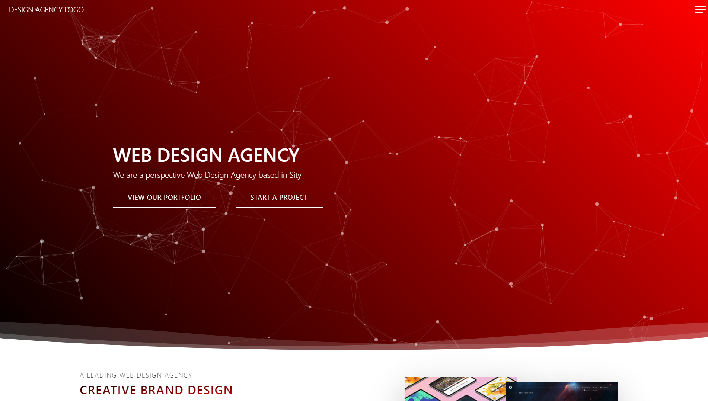

# Design Agency

The purpose of this website is to introduce people to the design agency.

## Functionality of the project

The site provides users with information about the design agency. It contains information about the agency's team, the design process, the latest websites created, client reviews, and more. 

You can visit website by clicking [this link](https://kanae367.github.io/design-agency-template/)

## The project was made using the following technologies:

- HTML
- CSS
- Flex
- SASS(Scss)
- JQuery validation
- Swiper
- Bootstrap
- Particles

## How to start

Clone the repository using the following command: 

`git clone https://github.com/kanae367/design-agency-template.git`

